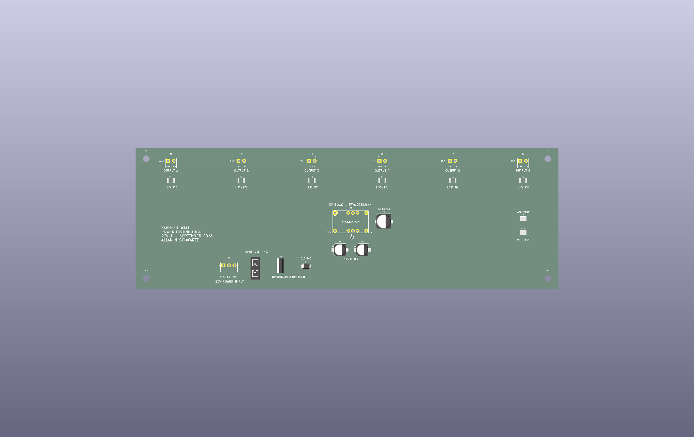

# Yahrzeit Wall Hardware

This directory contains the electrical and mechanical design files for the
Yahrzeit Wall controller, interface board, pixel boards, test fixtures, and
enclosures.

The current controller uses an Arduino Uno R4, an Arduino-compatible Ethernet
shield, and the Yahrzeit Controller Pixel Interface V3 board. The interface
board connects the controller stack to the installed chain of YYZ Pixel boards.

*The bench-test fixture brings together the controller stack, Pixel Interface
board, and two nine-section YYZ Pixel boards.*

## 3D-Printed Parts

The files under [`3D Printing`](3D%20Printing/) may be browsed
online, with GitHub displaying the JPEG photographs and interactive previews of
the STL models.

### Commercial Controller Enclosure

- [arduino\_uno\_r4\_commercial\_enclosure\_vendor.jpg](3D%20Printing/arduino_uno_r4_commercial_enclosure_vendor.jpg)
  -- Vendor product photograph, saved from the Amazon listing, showing the
  commercial enclosure with an Arduino Uno R4 and an Ethernet-shield stack.

### Production Mounting Flange

The production controller uses a commercial enclosure with a custom
3D-printed flange that adapts its DIN-rail mounting feature for flat wall
mounting.

- [mount\_flange.scad](3D%20Printing/mount_flange.scad) -- Parametric OpenSCAD
  source.
- [mount\_flange.stl](3D%20Printing/mount_flange.stl) -- Printable mounting
  flange.

### Alternative Controller Enclosure

This enclosure was designed for the three-board controller stack. The
close-fitting commercial enclosure documented in the embedded-controller
installation notes is the preferred production enclosure, but this printable
design is retained as a replacement option and design reference.

- [yahrzeit\_controller\_case.scad](3D%20Printing/yahrzeit_controller_case.scad)
  -- Parametric OpenSCAD source.
- [yahrzeit\_controller\_case.stl](3D%20Printing/yahrzeit_controller_case.stl)
  -- Printable enclosure body.
- [yahrzeit\_controller\_case-cover.stl](3D%20Printing/yahrzeit_controller_case-cover.stl)
  -- enclosure cover.
- [yahrzeit\_controller\_case.jpg](3D%20Printing/yahrzeit_controller_case.jpg)
  -- Photograph of the printed enclosure body.

### Test-Fixture Plate

The fixture plate supports the small YYZ Pixel test assembly used during
controller development and bench testing.

- [fixture\_plate.scad](3D%20Printing/fixture_plate.scad) -- Parametric OpenSCAD
  source.
- [fixture\_plate.stl](3D%20Printing/fixture_plate.stl) -- Printable fixture
  plate.
- [fixture\_plate.jpg](3D%20Printing/fixture_plate.jpg) -- Photograph of the
  printed fixture plate.

## Yahrzeit Controller Pixel Interface V3

*KiCad rendering of the Yahrzeit Controller Pixel Interface V3 board.*

The current interface board adapts the Arduino controller stack to the
five-signal YYZ Pixel ribbon cable and provides the green ALIVE status LED.

- [pixel\_interface\_v3.kicad\_pro](pixel_interface_v3/pixel_interface_v3.kicad_pro)
  -- Open this project file in KiCad.
- [pixel\_interface\_v3.kicad\_sch](pixel_interface_v3/pixel_interface_v3.kicad_sch)
  -- KiCad schematic.
- [pixel\_interface\_v3.kicad\_pcb](pixel_interface_v3/pixel_interface_v3.kicad_pcb)
  -- KiCad PCB layout.
- [pixel\_interface\_v3-3D viewer.png](pixel_interface_v3/pixel_interface_v3-3D%20viewer.png)
  -- KiCad 3D rendering.
- [pixel\_interface\_v3-schematic.png](pixel_interface_v3/pixel_interface_v3-schematic.png)
  -- Schematic preview.
- [pixel\_interface\_v3\_D1\_polarity\_note.pdf](pixel_interface_v3/pixel_interface_v3_D1_polarity_note.pdf)
  -- Status-LED polarity and assembly note.

## Nine-Section YYZ Pixel Board

*KiCad rendering of the nine-section YYZ Pixel board.*

The `yahrzeit_pixel9` board combines nine complete YYZ Pixel circuits on one PCB, using the same octal bus transceiver and 8-bit shift register as the individual boards installed in the wall. A single `yahrzeit_pixel9` behaves as one complete Yahrzeit Wall panel, allowing a desktop test fixture to be constructed. Two or more yahrzeit_pixel9 boards may be chained together to emulate multiple panels.

*The reusable KiCad hierarchical sheet implements one eight-pixel YYZ Pixel
circuit. The `yahrzeit_pixel9` top-level schematic instantiates this sheet nine
times.*

- [yahrzeit\_pixel9.kicad\_pro](yahrzeit_pixel9/yahrzeit_pixel9.kicad_pro) --
  Open this project file in KiCad.
- [yahrzeit\_pixel9.kicad\_sch](yahrzeit_pixel9/yahrzeit_pixel9.kicad_sch) --
  KiCad top-level schematic.
- [pblock.kicad\_sch](yahrzeit_pixel9/pblock.kicad_sch) -- Reusable
  eight-pixel hierarchical sheet.
- [yahrzeit\_pixel9.kicad\_pcb](yahrzeit_pixel9/yahrzeit_pixel9.kicad_pcb) --
  KiCad PCB layout.
- [yahrzeit\_pixel9-schematic.pdf](yahrzeit_pixel9/yahrzeit_pixel9-schematic.pdf)
  -- multipage schematic.
- [yahrzeit\_pixel9.png](yahrzeit_pixel9/yahrzeit_pixel9.png) -- KiCad board
  rendering.

## YYZ Pixel Board V2

*Schematic of the preliminary YYZ Pixel Board V2 design.*

YYZ Pixel Board V2 is a proposed modern replacement for an individual
installed pixel board. It retains the legacy 74HC245 input buffer, 74HC595
shift register, 5 V power daisy chain, and 2x5 signal-cable interface so that
it can be evaluated with the existing wall and controller. The present
prototype provides eight LED channels. Its LED resistors intentionally use
four different values, in pairs, so brightness and current can be compared
with the original wall before a production value is selected.

This is design work in progress, not a released production board. Connector
part numbers, the final LED resistor value, cable construction, power margin,
and mechanical fit must be confirmed before fabrication or installation.

- [yahrzeit\_yyz\_pixel-v2.kicad\_pro](yahrzeit_yyz_pixel-v2/yahrzeit_yyz_pixel-v2.kicad_pro)
  -- Open this project file in KiCad.
- [yahrzeit\_yyz\_pixel-v2.kicad\_sch](yahrzeit_yyz_pixel-v2/yahrzeit_yyz_pixel-v2.kicad_sch)
  -- KiCad schematic.
- [yahrzeit\_yyz\_pixel-v2.kicad\_pcb](yahrzeit_yyz_pixel-v2/yahrzeit_yyz_pixel-v2.kicad_pcb)
  -- Preliminary KiCad PCB layout.
- [YYZ\_PIXEL\_V2\_CABLE\_AND\_POWER\_NOTES.md](YYZ_PIXEL_V2_CABLE_AND_POWER_NOTES.md)
  -- Field observations and deferred cable, signal-integrity, and power-design
  decisions.

## Column Power Distribution Board

*Preliminary layout of the proposed column power-distribution board.*

The proposed power-distribution assembly replaces the direct 5 V supply and
wire-nut fan-out for one vertical panel column. One assembly serves six
56-LED branches. It accepts nominal 12 V input, uses a TI PTH12060WAH
through-hole module to produce regulated 5 V, and provides six individually
protected outputs. Input reverse-polarity and transient protection, local
filtering, clearly polarized connectors, and accessible 5 V/GND test points
make the assembly easier to diagnose and replace in the field.

The long-term concept uses one assembly for each of the wall's seven panel
columns, plus complete spare assemblies and purpose-built labeled cables. The
entire board-and-cable assembly is intended to be a field-replaceable unit.
The design remains preliminary: measured wall current, fuse ratings, thermal
performance, copper geometry, connector selections, cable lengths, and
installation clearances must be verified before production.

- [yahrzeit\_power\_dist.kicad\_pro](yahrzeit_power_dist/yahrzeit_power_dist.kicad_pro)
  -- Open this project file in KiCad.
- [yahrzeit\_power\_dist.kicad\_sch](yahrzeit_power_dist/yahrzeit_power_dist.kicad_sch)
  -- KiCad schematic.
- [yahrzeit\_power\_dist.kicad\_pcb](yahrzeit_power_dist/yahrzeit_power_dist.kicad_pcb)
  -- Preliminary PCB placement and routing.
- [power\_dist.schematic.pdf](power_dist.schematic.pdf) -- Schematic PDF for
  review without KiCad.
- [yahrzeit\_power\_dist.png](yahrzeit_power_dist/yahrzeit_power_dist.png) --
  KiCad board rendering.
- [DESIGN\_TODO.md](yahrzeit_power_dist/DESIGN_TODO.md) -- Outstanding
  component-selection, indicator, layout, and pre-fabrication checks.

## Reference Schematics

Approximately 280 individual YYZ Pixel boards are installed behind the
Yahrzeit Wall's etched-glass memorial panels. Three variations support six,
eight, or ten memorial lights. Their common circuit is documented in:

- [Schematic\_yyz\_pixel.pdf](schematics/Schematic_yyz_pixel.pdf) -- Original
  installed YYZ Pixel board schematic.
- [YYZ\_PIXEL\_BOARD\_REPAIR.md](YYZ_PIXEL_BOARD_REPAIR.md) -- Customer procedure
  for replacing and verifying an installed pixel board using a tested spare.
- [YYZ\_PIXEL\_BOARD\_TESTING.md](YYZ_PIXEL_BOARD_TESTING.md) -- Optional
  engineering or electronics-technician procedure for bench-testing a removed
  board, including the special controller cable and Saleae logic-analyzer
  checks.
- [YYZ\_PIXEL\_V2\_CABLE\_AND\_POWER\_NOTES.md](YYZ_PIXEL_V2_CABLE_AND_POWER_NOTES.md)
  -- Deferred Version 2 design notes covering signal-cable construction,
  shielding and grounding alternatives, field cable-retention observations,
  and power-supply margin.
  
The nine-section board is electrically nine of these circuits condensed onto
one PCB. Both designs use the same 74HC245 octal bus transceiver and
74HC595 8-bit shift register:

- [74HC\_HCT245.pdf](schematics/74HC_HCT245.pdf) -- Bus-transceiver data sheet.
- [74HC\_HCT595.pdf](schematics/74HC_HCT595.pdf) -- Shift-register data sheet.

The [`schematics`](schematics/) directory also preserves the relevant Arduino
and Ethernet reference schematics.

## See Also

- **Project**
  - [`./README.md`](../README.md)
- **Server**
  - [`./yahrzeit_site-v3/README.md`](../yahrzeit_site-v3/README.md)
  - [`./yahrzeit_site-v3/INSTALL.md`](../yahrzeit_site-v3/INSTALL.md)
- **Controller**
  - [`./embedded/yahrzeit_v3/README.md`](../embedded/yahrzeit_v3/README.md)
  - [`./embedded/yahrzeit_v3/INSTALL.md`](../embedded/yahrzeit_v3/INSTALL.md)
- **Hardware**
  - [`./Hardware/README.md`](README.md)
