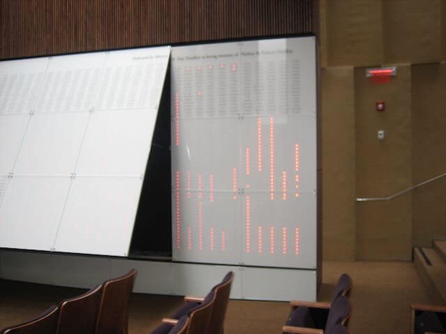
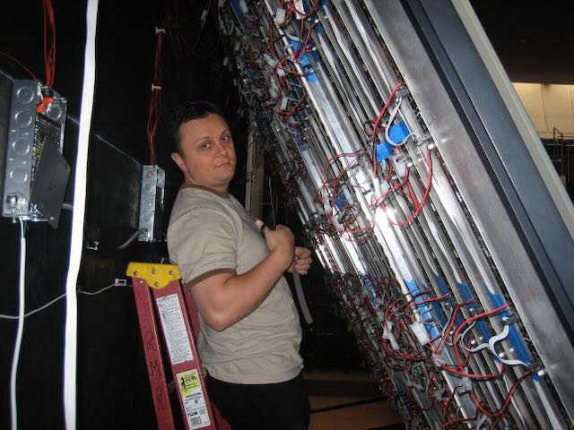
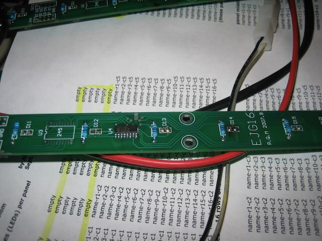

# YYZ Pixel Board Replacement Guide

*A complete wall section tilts outward to provide access for service.*

This guide describes how the customer identifies a failed board and replaces
it with a tested spare. It does not cover component-level diagnosis or repair
of the removed board.

The wall contains approximately 280 pixel boards. Three boards have required
attention after about 20 years of service: `3 / 280 = 1.07%` of the installed
population. That is a very good service record. The 1.07% figure is the
observed fraction of boards needing attention, not an annual failure rate.

## Safety and handling

- A wall section must be tilted out to reach its rear. Secure it with the
  dedicated 3- or 4-foot wooden service prop before anyone works behind it.
  Position the prop as demonstrated and make sure that it cannot slip. Do not
  rely on a person to hold the section open. Retain the prop for future board replacements.
- Switch off the Yahrzeit Wall using the labeled power switch on the other side
  of the wall, in the synagogue book lobby, before connecting, disconnecting,
  or reseating any pixel board or ribbon cable.
- Photograph the board and both connector orientations before removal.
- Label the board with its wall location and its six-, eight-, or ten-light
  configuration. Do not rely on memory.
- Use normal antistatic precautions when handling the PCB, especially its
  surface-mount components.
- The data connectors are not keyed and can physically be inserted backward.
  They must not be reversed electrically. Confirm `GND` and
  `DI` against the board markings and the boards above and below before
  applying power. Never use the ribbon cable's red stripe alone to determine
  orientation: existing cables do not all place the stripe on the same signal
  side.
- The power connectors are keyed. Do not force them if they do not mate
  naturally. If they do not mate, recheck the board's orientation.
- If there is overheated wiring, a burnt board, damaged insulation, or an
  uncertain power connection, stop and obtain qualified assistance before
  proceeding.

## What to record before removing a board

Test the wall first and write down the exact symptom. Determine whether the
fault affects one memorial light, all lights on one board, or this board and
boards farther along the same cable path.

Record whether a light is always off, always on, incorrect only in some test
patterns, or intermittent. Also record whether supporting the cable or
connector changes the symptom; do not unplug or move a connector while power
is on.

## Access behind the wall

*The YYZ Pixel boards and their wiring are reached from behind the tilted
section. Secure the section with the retained wooden service prop and make sure
the prop cannot slip before proceeding.*

## Select the replacement board

YYZ Pixel boards were made in three physical sizes: 6-pixel, 8-pixel, and
10-pixel. Tested spares are supplied in all three sizes. Select the spare that
matches the removed board; the LED locations must correspond to the
machined holes in the aluminum chassis.

*Close-up of an installed YYZ Pixel board. The replacement must match its
length and LED spacing so the LEDs align with the chassis openings.*

Before disconnecting anything, photograph the top and bottom of the installed
board closely enough to show every power and data connection. On the back
side of the board (the side against the aluminum chassis), The LEDs are labeled
D1 through D8, for example (or the highest numbered LED). Note that `D1` is at the top
and D8, for example, is at the bottom.

## Try the connections before replacing the board

A connection or data cable may cause symptoms that appear to come from the
pixel board. Before removing a board:

1. Switch off the Yahrzeit Wall and verify that its LEDs are dark.
2. Photograph and label the top and bottom connections.
3. Replace both data-signal cables with known-good cables. Because these
   connectors are not keyed, explicitly verify `GND` to `GND` and `DI` to `DI`
   at both ends. Do not use the red stripe to determine orientation.
4. Unplug and firmly reconnect both keyed power connectors. Do not force them, but they must be firmly mated.
5. Inspect all four connections, restore power, and check the board and the
   boards farther along both data chains.

If normal operation returns, leave the board installed and record the cable or
connection correction. Replace the pixel board only if the fault remains.

## Replace a board

1. Secure the wall section with the wooden service prop in its tilted service
   position. Switch the Yahrzeit Wall off, and
   verify that its LEDs are dark.
2. Confirm that the replacement is the same 6-, 8-, or 10-pixel size as the
   installed board.
3. Photograph and/or label all four connections. Disconnect the top and bottom
   keyed power connectors, then the top and bottom data-chain connectors. Pull
   on connector bodies, not wires.
4. Slide a putty knife carefully between the old board's adhesive and the
   aluminum chassis. The board is normally held by three pieces of double-sided
   tape. Work gradually to avoid damaging the chassis, cracking the PCB, or
   damaging wiring.
5. Remove every remnant of the old double-sided tape from the chassis. The
   mounting surface must be clean and flat before the spare is positioned.
6. Determine the spare's top and bottom **before** applying tape. The board is
   oriented with `D1` at the top and the highest numbered LED—`D6`, `D8`, or
   `D10`, depending on the board size—at the bottom. These markings are on the
   face that will be adhered to the aluminum and will no longer be visible
   afterward.
7. Insulate the solder-side pins of all four through-hole connectors—the top
   and bottom data connectors and the top and bottom power connectors—so they
   cannot short against the aluminum. Double-sided mounting tape may be placed
   over these pins, or black electrical tape may be used as insulation. Check
   that no connector pin can touch bare aluminum.
8. Apply new double-sided mounting tape. Do not remove its chassis-side release
   liner until orientation and alignment have been checked.
9. Precisely align the PCB's silkscreened alignment marks with the marks drawn
   on the aluminum chassis. This positions every LED behind its machined hole.
   Check all LED positions visually, then press the board firmly into place.
10. Reconnect both keyed power connectors. Reconnect the top and bottom data
    connectors exactly as photographed. At each data connector, trace the
    conductors and explicitly verify `GND` to `GND` and `DI` to `DI`; the red
    stripe is not a reliable polarity indicator.
11. Inspect for trapped wires, exposed connector pins touching aluminum,
    reversed data connectors, and LEDs out of alignment. Only then restore
    power and verify operation using the normally installed Wall system.

> **Critical:** A data plug can physically fit the wrong way. Correct
> orientation is established by the `GND` and `DI` signals—not by the cable's
> red stripe.

## Verify the replacement

After restoring power, use the normally installed Wall system to confirm that:

- every LED on the replacement board operates;
- the replacement board's LEDs align with the chassis openings;
- the boards farther along both data-chain connections still operate; and
- no cable is trapped, strained, or touching an unsafe location.

If the replacement or any following board does not operate correctly, switch
the Wall off again. Recheck the replacement's orientation and verify `GND` to
`GND` and `DI` to `DI` at both data connectors. Do not repeatedly apply power
while the connector orientation is uncertain.

## Replacement record

Record each replacement so the spare inventory and Wall history remain clear.

| Date | Wall location | Board size | Original symptom | Replacement result |
|---|---|---:|---|---|
|  |  | 6/8/10 |  |  |
|  |  | 6/8/10 |  |  |
|  |  | 6/8/10 |  |  |
|  |  | 6/8/10 |  |  |

## References

- [Hardware overview](README.md)
- [Original YYZ pixel-board schematic](schematics/Schematic_yyz_pixel.pdf)
