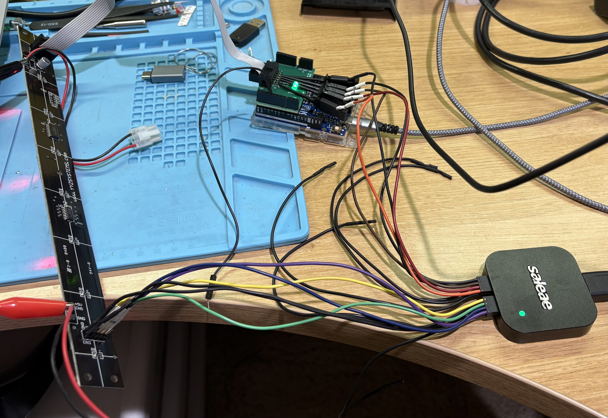
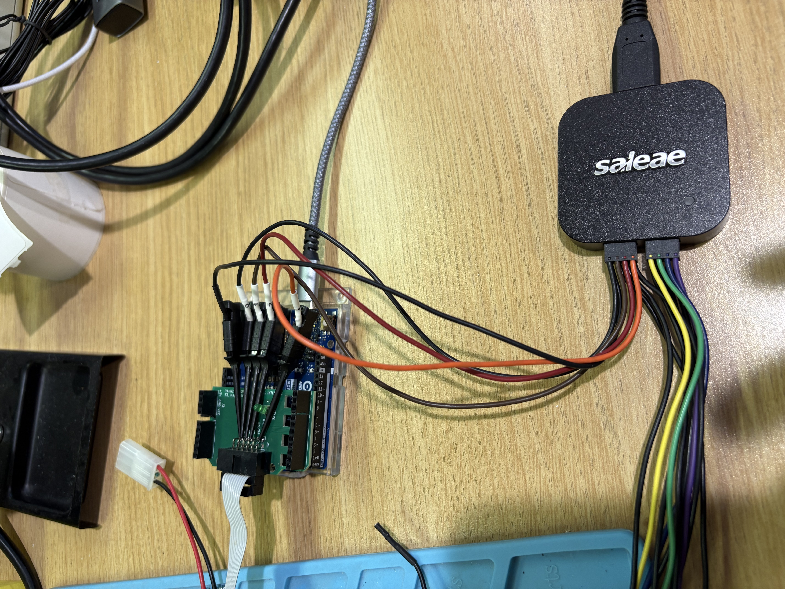
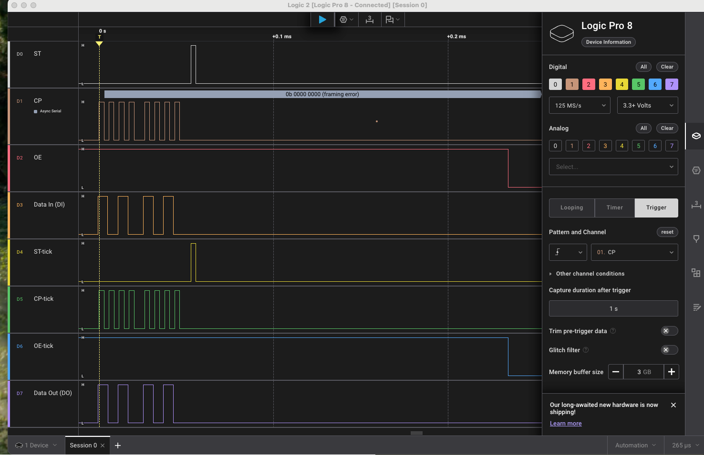

# YYZ Pixel Board Bench Testing

<a href="images/yyz_pixel_bench_test_setup.jpg">
  
</a>

*Complete single-board test setup: YYZ Pixel board, Arduino controller with
Pixel Interface V3, current-limited bench power, and Saleae logic analyzer.*

This is the engineering procedure for testing one removed YYZ Pixel board with
the Arduino controller, Pixel Interface V3, a current-limited 5V power supply, and
optionally a Saleae logic analyzer. It complements the customer-facing
[board-replacement guide](YYZ_PIXEL_BOARD_REPAIR.md), which deliberately does
not require firmware installation, bench instrumentation, or electronic
rework skills.

YYZ Pixel boards exist in 6-, 8-, and 10-pixel versions. You will be setting the controller's runtime geometry to the exact physical size of the board-under-test.

## Essential equipment

- Arduino controller with the current `yahrzeit_v3` firmware
- Pixel Interface V3 and its controller-to-first-board ribbon cable
- Regulated, current-limited 5V bench power supply
- Known-good power and data cables
- Known-good YYZ Pixel board for comparison
- Multimeter
- Saleae Logic 8 or Logic Pro 8, (or equivalent) strongly recommended
- Insulated probes or micro-grabbers as needed

The current-limited supply is mandatory. An accidental +5V-to-ground short is
easy to make on this fixture; current limiting protects the board and test
equipment when that happens. Set 5.0 V and use a conservative current limit
for example 0.5 A.

## Critical controller-cable modification

> **The direct controller-to-first-board ribbon cable is special. One
> conductor must be cut. Do not substitute an ordinary unmodified
> board-to-board ribbon cable.**

The original YYZ Pixel design used one conductor of the nominal `DI` pair as `D*`, the serial-data return path for the original column-to-column wiring. That return scheme was later abandoned in favor of long ribbon cables. The Pixel Interface V3 drives both conductors of this pair as `DI`; consequently, an unmodified cable ties `DI` to the board’s `D*` output. Cutting the `D*` conductor removes that conflict while leaving the other `DI` conductor connected.

The original 2008 schematic records the field modification as:

> If CN1 connects to the controller's port, cut wire number 10.

There is no reliable pin-1 indicator on these cables, and some installed cables
were reversed because of connector-key orientation. Therefore, do not identify
the conductor by the red stripe, connector key, or physical left/right position
alone.

With all power disconnected, identify the two ribbon cable conductors forming the DI pair at the Pixel Interface V3 end. Cut the outside-edge member of that pair—the conductor that reaches D* at CN1. Bend the cut conductor back so that it cannot make contact, and label the cable:

```text
PIXEL I/F -> FIRST YYZ PIXEL
```

## Connect the board

<a href="images/pixel_interface_saleae_micrograbbers.jpg">
  
</a>

*Micro-grabbers provide convenient access to `DI`, `OE`, `CP`, and `ST` at the
Pixel Interface V3 90° signal connector.*

1. Turn off the bench supply and disconnect its output.
2. Set the supply to 5.0 V with current limiting enabled; for example, use a
   0.5 A current limit.
3. Prepare a keyed Molex power harness that mates with the power connector at
   the top of the board, adjacent to capacitor C3. Power this harness from the
   current-limited bench supply.
4. As you seat the connector, visually trace the harness wires and double-check that +5V aligns with +5V and GND aligns with GND on the board connector.
6. Connect Pixel Interface V3 to the board's CN1 using the specially modified
   controller cable described above.
7. Verify the orientation of the unkeyed data connector: `GND` must connect
   to `GND`, and `DATA` must connect to `DI`. Use the ribbon cable's red stripe
   only to trace the same edge from the Pixel I/F shield to the
   board-under-test; the stripe does not inherently identify either signal.
8. Inspect for adjacent pins bridged by probes or exposed conductors.
9. Enable the bench supply while watching its current indication. Switch it
   off immediately if it enters current limit unexpectedly.

## Configure the controller

At the serial console, select the board's physical size. Use exactly one of:

```text
geometry 6
geometry 8
geometry 10
```

The column count defaults to one. Confirm the result:

```text
status
```

For maximum steady brightness during basic tests:

```text
bright 0
```

Brightness is implemented through active-low OE pulse-width-modulation (PWM) brightness control, so `0` means fully enabled/bright and `255` means fully disabled.

## Functional tests

Run the tests individually and observe the board after each one:

```text
test 1
test 2
test 3
test 4
test 5
```

| Command | Expected result | Primary use |
|---|---|---|
| `test 1` | Corner/end pixels | Address-range and orientation check |
| `test 2` | All pixels on | Finds dead outputs and power faults |
| `test 3` | All pixels off | Finds stuck-on outputs and leakage |
| `test 4` | Alternating checkerboard | Finds adjacent-bit and data-order faults |
| `test 5` | One row/pixel position at a time | Identifies a particular failed channel |

Use `dump` to confirm the logical framebuffer independently of the physical
LEDs. `refresh` retransmits and latches the framebuffer without changing it.

## Expected 74HC595 timing

The board uses `DI` as 74HC595 serial data, `CP` as the shift-register clock,
`ST` as the storage-register latch clock, and active-low `OE` as output enable.

During `refresh`:

1. `OE` goes HIGH to blank the LEDs.
2. Data is made stable before each rising edge of `CP`.
3. One `CP` pulse is generated per active pixel position.
4. After the final bit, `ST` receives one rising pulse to transfer the shift
   register into the output/storage register.
5. OE returns to its configured PWM brightness behavior.

The 74HC595 samples serial data on the **rising edge of CP**. The firmware
shifts rows in descending order and electrically inverts logical pixels for
the board's active-low LED wiring. Consequently, the DI pattern observed on a
logic analyzer may look reversed and inverted relative to the row order shown
by `dump`; this is expected.

## Saleae eight-channel comparison

The accessible CN1 and CN3 connectors make it possible to compare signals on
both sides of the board without probing fine-pitch IC pins.

| Saleae channel | Test point |
|---|---|
| D0 | CN1 `ST` input |
| D1 | CN1 `CP` input |
| D2 | CN1 `OE` input |
| D3 | CN1 `DI` input |
| D4 | CN3 `ST-tick` output |
| D5 | CN3 `CP-tick` output |
| D6 | CN3 `OE-tick` output |
| D7 | CN3 `DO` serial-data output |

The `-tick` spelling is used in Saleae channel labels as a visible substitute
for the schematic's prime mark.

<a href="images/saleae_single_pixel_refresh.png">
  
</a>

*Eight-channel diagnostic capture that led to discovery of the pin-10 cable
problem. ST, CP, and OE are reproduced through the 74HC245, and DO shows serial
data leaving the 74HC595. In this capture, the extra Saleae ground connections
were temporarily altering the faulty return path; the waveforms remain a useful
timing reference.*

In Saleae Logic 2:

1. Select **Trigger** capture mode.
2. Select D1/CP as the trigger channel.
3. Select the rising-edge trigger symbol.
4. Leave other channel conditions unconstrained.
5. Start the capture, then issue `refresh` at the Arduino Monitor.

The display may stream while Saleae fills its pre-trigger buffer. It freezes
the requested capture after the trigger occurs. An accidentally installed
Async Serial analyzer on CP will report framing errors; those annotations are
irrelevant and may be ignored or the analyzer removed.

### Interpreting the paired signals

- `ST-tick`, `CP-tick`, and `OE-tick` should exactly reproduce their CN1
  inputs. Only the 74HC245 propagation delay separates them.
- DO is **not** a buffered copy of DI. It is the bit shifted out of the far end
  of the 74HC595 and therefore represents the register's previous contents.
- If the same repeating checkerboard is refreshed twice, DI and DO can appear
  identical because the old and new register contents are identical.

To demonstrate the distinction, first run `test 3`. Arm Saleae, then run
`test 4`. DI will contain the new alternating pattern while DO initially
contains the previous all-off pattern. A later unchanged `refresh` may make
them overlay again.

## Fault isolation

| Observation | Likely area |
|---|---|
| No input signals at CN1 | Controller, Pixel Interface, or controller cable |
| Input signals present but paired `-tick` signal missing | 74HC245, its power, solder joint, or PCB trace |
| CP/ST/OE reproduce correctly but DO never shifts | 74HC595 shift section, its power, solder joint, or data path |
| Correct shifting and latch, but board remains blank with OE LOW | 74HC595 output section, LED power, or output circuitry |
| Board works only when extra analyzer grounds are attached | Stop and inspect cable pin 10/`D*`, true ground continuity, and cable orientation |
| One LED alone fails | That LED, its resistor, solder joints, trace, or corresponding 74HC595 output |
| Board and downstream boards fail | Incoming cable, power/ground, buffer, or serial-chain path |

Do not infer that a board is bad until it has been tested with the correctly
modified controller cable and known-good power/data connections. The pin-10
ground conflict can imitate a board failure while all four controller-side
logic signals appear reasonable.

## Test record

| Date | Board size/ID | Cable pin 10 open | Tests 1-5 | Saleae result | Disposition |
|---|---|---|---|---|---|
|  | 6 / 8 / 10 |  |  |  |  |
|  | 6 / 8 / 10 |  |  |  |  |
|  | 6 / 8 / 10 |  |  |  |  |
|  | 6 / 8 / 10 |  |  |  |  |

## References

- [Original YYZ Pixel schematic](schematics/Schematic_yyz_pixel.pdf)
- [Pixel Interface V3 schematic](pixel_interface_v3/pixel_interface_v3-schematic.png)
- [Controller commands and firmware behavior](../embedded/yahrzeit_v3/README.md)
- [74HC/HCT245 data sheet](schematics/74HC_HCT245.pdf)
- [74HC/HCT595 data sheet](schematics/74HC_HCT595.pdf)
