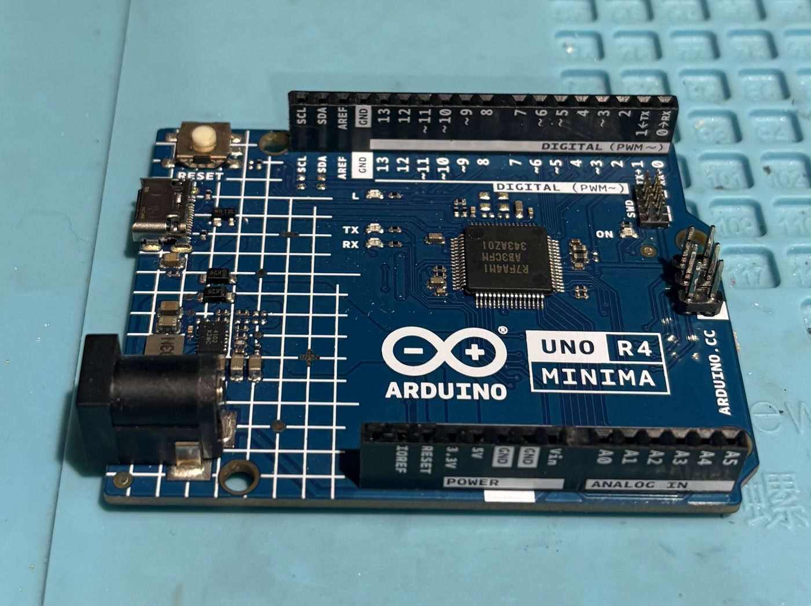
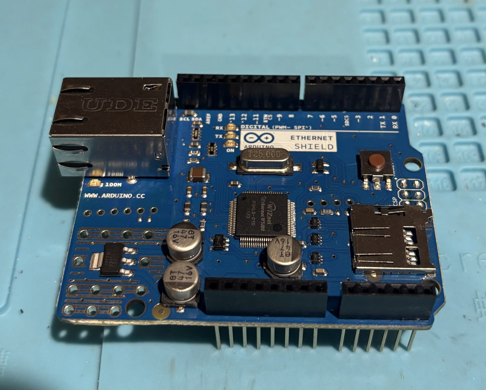
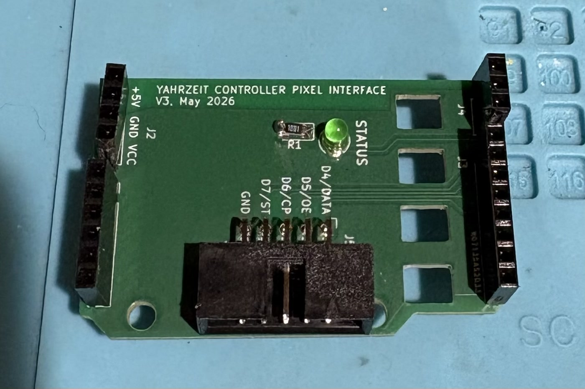

# Yahrzeit Embedded Controller — Installation Notes

These notes describe how to build, install, and verify the firmware for the
Arduino-based Yahrzeit Wall controller. They are intended for installation or
replacement of the controller, not for routine operation of the wall.

The firmware is not installed by a script. It is configured in the source,
compiled with the Arduino toolchain, and uploaded over USB.

<p align="center">
  <a href="images/yahrzeit-controller-assembly.jpg">
    
  </a>
</p>

*The assembled controller in its close-fitting enclosure. The illuminated
green LED on the Pixel Interface board is the ALIVE indicator.*

## Hardware

The production controller stack is:

```text
Arduino Uno R4 Minima
  -> Arduino Ethernet Shield 2 or compatible W5100/W5500 shield
    -> Yahrzeit Controller Pixel Interface board
      -> ribbon cable to the YYZ Pixel board chain
```

<table>
  <tr>
    <td align="center">
      <a href="images/arduino-uno-r4-minima.jpg">
        
      </a><br>
      <em>Arduino Uno R4 Minima</em>
    </td>
    <td align="center">
      <a href="images/arduino-ethernet-shield.jpg">
        
      </a><br>
      <em>Ethernet shield</em>
    </td>
    <td align="center">
      <a href="images/yahrzeit-pixel-interface-board.jpg">
        
      </a><br>
      <em>Yahrzeit Controller Pixel Interface</em>
    </td>
  </tr>
</table>

The commercial enclosure has a DIN-rail attachment, but the wall installation
uses a custom 3D-printed flange for flat mounting. Remove the flange from the
wall by removing its two self-tapping wood screws. Retain those screws and use
them to reinstall the controller in the same location.

The clear cover deliberately fits snugly against the tops of the connectors.
When its screws are tightened, the cover helps keep the three stacked boards
from separating through vibration—or, this being San Francisco, an earthquake.
Do not add spacers that defeat this retaining function.

The enclosure assembly uses M2.5 x 5 mm machine screws. They can be difficult
to obtain in the United States. Keep all removed screws together, and obtain
replacements before beginning installation if any are missing.

The 3D-print source and output for the mounting flange are:

- [`mount_flange.scad`](../../Hardware/3D%20Printing/mount_flange.scad)
- [`mount_flange.stl`](../../Hardware/3D%20Printing/mount_flange.stl)

The same repository directory contains the OpenSCAD and STL files for an
alternative 3D-printable controller enclosure. However, the commercial
enclosure shown above is the preferred design.

Use the dedicated regulated Arduino power supply for production operation.
Do not depend on a computer's USB port to power the installed controller.

After startup completes, the green ALIVE LED on the Pixel Interface board
should slowly brighten and dim. This indicates that the firmware main loop is
running; it does not by itself prove that Ethernet communication is working.

Uploading or restarting the controller runs a short visible light test before
the saved display is restored. Perform installation when this will not disrupt
a service.

## Known-Working Development Toolchain

The following versions were installed on the development Mac in July 2026:

```text
Arduino IDE                       2.3.10
Arduino UNO R4 Boards core        1.6.0
Ethernet library                  2.0.2
```

Later compatible versions may also work, but have not been established by the
repository. If a different toolchain is used for a release, record its versions
with the release notes.

`EEPROM.h` is supplied by the Uno R4 board core. `Ethernet.h` is supplied by
the Arduino Ethernet library.

## Prepare the Arduino IDE

1. Install Arduino IDE 2.
2. In Boards Manager, install **Arduino UNO R4 Boards**.
3. In Library Manager, install **Ethernet** by Arduino.
4. Connect the Arduino Uno R4 Minima to the computer by USB.
5. Select **Arduino UNO R4 Minima** under **Tools > Board**.
6. Select the USB serial port for the connected controller.

Open `yahrzeit_v3.ino`. The Arduino IDE will load the other `.ino`, `.cpp`,
and `.h` files from the same sketch directory.

## Configure the Production Build

Before compiling firmware for Congregation Beth Sholom, make both of the
following checks.

### Display geometry

In `yahrzeit_v3.h`, enable the production wall and disable the test fixture:

```cpp
#define CBS_56x40_WALL    1
// #define TEST_FIXTURE    1
```

Exactly one geometry must be enabled. The checked-in development source may
instead select `TEST_FIXTURE`; do not install that build on the full wall.

### Network configuration

<p align="center">
  <a href="images/arduino-ethernet-shield.jpg">
    
  </a>
</p>

*The Ethernet shield provides the controller's wired network connection.*

In `yahrzeit_v3.ino`, confirm the production values in `networkConfig`:

```cpp
NetworkConfig networkConfig = {
    .mac = { 0x02, 0x19, 0x55, 0x11, 0x00, 0x09 },          // 1955-11-09
        // Values used at Congregation Beth Sholom
        .ipAddr = IPAddress(192, 168, 13, 9),
        .dnsAddr = IPAddress(8, 8, 8, 8),
        .gateway = IPAddress(192, 168, 13, 8),
        .subnet = IPAddress(255, 255, 255, 0),
};

static constexpr uint16_t SOCKET_LISTEN_PORT = 2001;
```

These are the historical CBS values in the source. Confirm them with the
current network administrator before installation. The controller address and
port configured in the PHP appliance must agree with the firmware.

If an installed release intentionally changes the geometry or site network
values, commit and tag those source changes so the installed firmware can be
reproduced.

## Compile and Upload

1. Recheck the selected board, serial port, geometry, and network values.
2. Use **Sketch > Verify/Compile** and resolve all errors before proceeding.
3. Use **Sketch > Upload**.
4. Open Serial Monitor at **115200 baud**.
5. Select a line ending that includes newline, such as **New Line** or
   **Both NL & CR**.

On restart, the serial output should identify the controller, detected
Ethernet hardware, configured IP address, listening TCP port, and completion
of controller startup. An explicit `ethernet: no hardware`, `ethernet: link
down`, or `socket: not started` message must be resolved before installation
is considered complete.

## Initialize and Verify

Through Serial Monitor, run:

```text
version
status
test 1
```

`test 1` lights the four corners of the selected display or panel. Other test
patterns are documented in `README.md`.

For a new controller, or whenever the validity of EEPROM contents is unknown,
establish a known saved state:

```text
all off
refresh
save
```

The firmware loads its saved framebuffer from EEPROM at every startup. Firmware
upload normally does not establish or validate that saved display state.

From a machine on the controller network, verify the TCP interface:

```sh
nc <controller-address> 2001
```

Then enter:

```text
version
status
```

From the PHP appliance directory, first generate and inspect the normal command
stream without contacting the controller:

```sh
bin/yahrzeit --dry-run
```

Finally, after confirming the configured controller address and ensuring that
it is safe to change the wall, verify the complete production path:

```sh
bin/yahrzeit
```

With no arguments, `bin/yahrzeit` computes the current normal Yahrzeit
lighting, transmits the complete command stream, refreshes the wall, and saves
the resulting controller state.

## Installation Record

Record the following with the installation or maintenance record:

- controller network configuration,
- normal Yahrzeit and full-wall brightness values configured in the PHP
  appliance,
- selected geometry (for example, 56 rows x 40 columns),
- Arduino environment:
   - IDE version,
   - Arduino UNO R4 Boards core version,
   - Ethernet library version,
- repository commit and release tag,
- date of upload, and
- result of serial, TCP, and appliance verification.

## Recovery or Replacement

To replace the Arduino, assemble the same controller stack, build the tagged
production source with the recorded configuration, and repeat the upload and
verification procedure above.

## See Also

- **Project**
  - [`./README.md`](../../README.md)
- **Server**
  - [`./yahrzeit_site-v3/README.md`](../../yahrzeit_site-v3/README.md)
  - [`./yahrzeit_site-v3/INSTALL.md`](../../yahrzeit_site-v3/INSTALL.md)
- **Controller**
  - [`./embedded/yahrzeit_v3/README.md`](README.md)
  - [`./embedded/yahrzeit_v3/INSTALL.md`](INSTALL.md)
- **Hardware**
  - [`./Hardware/README.md`](../../Hardware/README.md)
