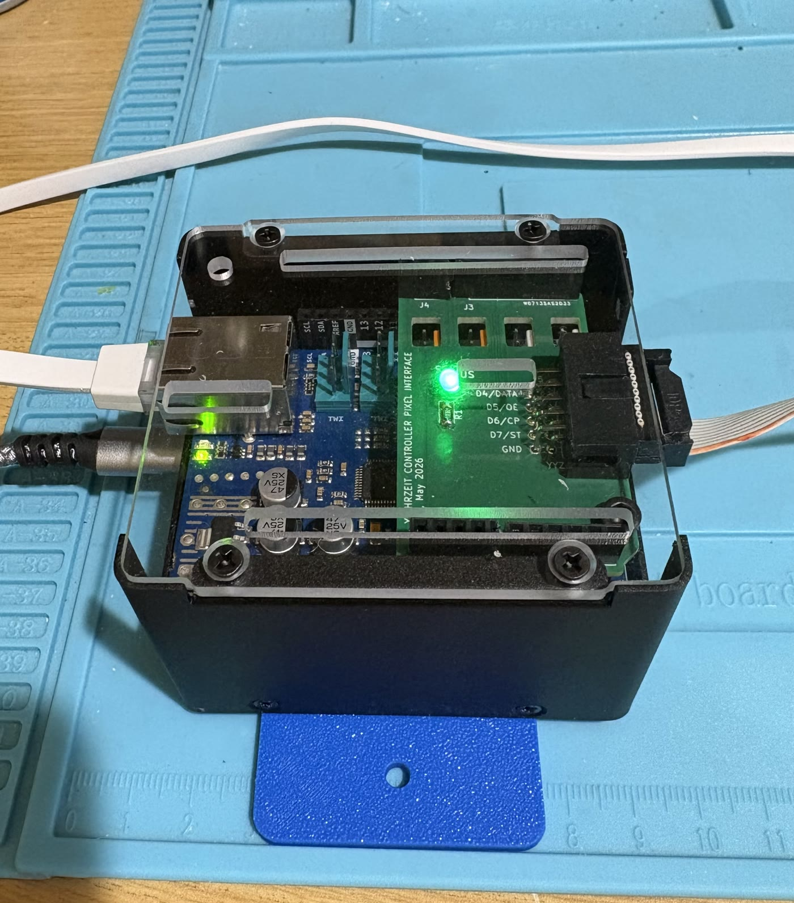

# Yahrzeit Embedded Controller

This directory contains the Arduino firmware for the third-generation
Yahrzeit Wall embedded controller.

This README is intended for future maintainers of the embedded controller.

The top-level repository README explains the full Yahrzeit project. The
`yahrzeit_site-v3` README explains the PHP/Linux appliance. This README is only
about the Arduino controller firmware in this directory. See `INSTALL.md` for
the production firmware build, upload, and verification procedure.

<p align="center">
  <a href="images/yahrzeit-controller-assembly.jpg">
    
  </a>
</p>

*The assembled controller in its close-fitting enclosure. The illuminated
green LED on the Pixel Interface board is the ALIVE indicator.*

## What This Controller Does

The embedded controller:

- receives line-oriented ASCII commands over USB serial or Ethernet TCP,
- maintains the LED wall framebuffer,
- maps wall/panel coordinates to the physical pixel chain,
- refreshes the shift-register LED hardware,
- saves and loads display state through EEPROM,
- runs bring-up and self-test patterns,
- and reports status/version/network information for diagnostics.

The normal production control path is:

```text
PHP appliance bin/yahrzeit
  -> nc TCP connection
    -> Arduino Ethernet socket on port 2001
      -> socket_thread.ino
        -> CmdProc
          -> LedWall
            -> YyzPixel
```

The command line interface is normally accessed through a TCP connection,
and received in `socket_thread.ino`.  
However, USB serial uses the same command processor through `serial_thread.ino`.

## Hardware Stack

The V3 controller stack is:

```text
Arduino Uno R4 Minima
  -> Arduino Ethernet Shield 2 or compatible W5100/W5500 shield
    -> Yahrzeit Controller Pixel Interface board
      -> ribbon cable to YYZ Pixel board chain
```

### Ethernet Shield

The Ethernet shield uses the Arduino SPI interface; D10 is the chip select:

```text
D10     CS      Chip select
D11     MOSI    Master out, slave in  (aka COPI)
D12     MISO    Master in, slave out  (aka CIPO)
D13     SCK     Serial clock
```

## Pin Assignments

Pin definitions live in `yahrzeit_v3.ino`.

Names `DI`, `OE`, `CP`, `ST` match the pixel interface board silkscreen, and likewise the YYZ PIXEL boards silkscreen:

```text
STATUS LED  D3
DI          D4    data input (input to the PIXEL board)
OE          D5    output enable, active low
CP          D6    clock pulse
ST          D7    store/latch pulse
```

Do not change these casually; the shield/interface wiring depends on them.

## Source Files

- `yahrzeit_v3.ino` - setup, main loop, startup sequence, network defaults,
  pin definitions, global objects, status LED, panic handling.
- `yahrzeit_v3.h` - project-wide constants, active geometry selection,
  configuration structs, externs, assertion macros, shared declarations.
- `socket_thread.ino/.h` - Ethernet initialization and TCP command input.
- `serial_thread.ino/.h` - USB serial command input.
- `CmdProc.cpp/.h` - ASCII command parser and dispatcher.
- `LedWall.cpp/.h` - logical wall/panel abstraction and coordinate mapping.
- `YyzPixel.cpp/.h` - packed framebuffer and low-level shift-register driver.
- `selftest.ino/.h` - self-test patterns.

## Active Geometry

Select exactly one geometry in `yahrzeit_v3.h`:

```cpp
// #define CBS_56x40_WALL    1
#define TEST_FIXTURE    1
```

Current geometry definitions in `LedWall.cpp`:

```text
CBS_56x40_WALL:
  56 rows x 40 columns
  21 logical panels

TEST_FIXTURE:
  24 rows x 6 columns
  2 logical panels
  each fixture panel is 24 rows x 3 columns
```

For production installation, enable `CBS_56x40_WALL` and disable
`TEST_FIXTURE`.


## Network Defaults

Network defaults are in `yahrzeit_v3.ino`.

Production/CBS wall defaults:

```cpp
NetworkConfig networkConfig = {
    .mac = { 0x02, 0x19, 0x55, 0x11, 0x00, 0x09 },
        // Values used at Congregation Beth Sholom
        .ipAddr = IPAddress(192, 168, 13, 9),
        .dnsAddr = IPAddress(8, 8, 8, 8),
        .gateway = IPAddress(192, 168, 13, 8),
        .subnet = IPAddress(255, 255, 255, 0),
};

static constexpr uint16_t SOCKET_LISTEN_PORT = 2001;
```

There are also defaults for Allan's home-lab:

```text
IP       192.168.86.240
Gateway  192.168.86.1
Subnet   255.255.255.0
Port     2001
```

The PHP appliance reads the controller hostname/address and TCP port from
`bin/yahrzeit-controller.conf`. During installation, it offers the previously
recorded controller host as the default. The resulting appliance host and port
must match the values installed in the controller firmware.

## Ethernet Notes

`socket_thread.ino` supports W5100/W5200/W5500-class Ethernet hardware through the Arduino Ethernet library.

Startup serial output reports the detected Ethernet chip and local IP address.

The code treats only an explicit `LinkOFF` as unavailable. This matters because
some W5100-class hardware may not report link status as `LinkON` even when
socket communication works.

The `status` command reports the Arduino board model, selected display
configuration, dimensions, current brightness, configured network addresses
and TCP port, detected Ethernet hardware, link state, and whether a TCP client
is currently connected. It can be issued through USB Serial Monitor even when
TCP communication is not working, making it the primary tool for diagnosing
network problems.

The `version` command reports the Git-derived firmware release identifier and
the date and time at which the firmware was compiled. The release identifier
is generated as part of the build procedure documented in `INSTALL.md`.

## Serial Console

USB serial is initialized at:

```text
115200 baud
```

The serial path and socket path both feed the same command processor.

## Command Protocol

Commands are ASCII, line-oriented, and may usually be abbreviated to the first
two letters.

### Commands Used by the PHP Appliance

```text
All  on|off [<panel>]
BRightness <n> (1:bright, 254:dim)
PIxel on|off <row> <col> [<panel>]
REfresh
SAve
```

### Additional Controller Commands

```text
DAta <row> <col> <binary data>
LOad
```

### Maintenance and Diagnostic Commands

```text
DUmp [<panel>]
HElp
STatus
TEst <testnumber> [<panel>]
TIming on|off
VErsion
```

`PANEL0` / panel `0` means the whole active display. Panels `1` through
`displayConfig.nPanels` address individual logical panels.

## Self Tests

The `TEST` command supports:

```text
TEst 1 [<panel>]  -- 4 corners ON
TEst 2 [<panel>]  -- all pixels ON
TEst 3 [<panel>]  -- all pixels OFF
TEst 4 [<panel>]  -- checkerboard test
TEst 5 [<panel>]  -- marching row pattern
TEst 6 [<panel>]  -- marching column pattern
```

## Startup Behavior

On startup, `setup()`:

1. enables the status LED,
2. starts USB serial,
3. initializes Ethernet,
4. starts the command socket if Ethernet is available,
5. initializes the pixel driver and wall abstraction,
6. prints the version string,
7. runs a short light-test sequence,
8. loads the last saved framebuffer from EEPROM,
9. refreshes the display.

## Safe Bench Tests

Serial console:

```text
?
status
version
timing on
refresh
test 1
test 2
test 3
test 4
```

TCP socket from a machine on the same network:

```sh
nc <controller-ip> 2001
```

Then type the same line-oriented commands.

This is the direct test of TCP communication between the appliance and the
embedded controller. In particular, enter:

```text
version
status
```

For complete appliance-to-controller verification, follow the build, upload,
and commissioning procedure in [INSTALL.md](INSTALL.md).

## Building and Installing

See [INSTALL.md](INSTALL.md) for the known-working Arduino toolchain,
production geometry and network configuration, Git-derived release identifier,
firmware compilation and upload, verification tests, and installation record.

## Maintenance Warnings

- Do not change the command protocol unless the PHP appliance and embedded controller are updated at the same time.
- Do not change panel geometry without checking `LedWall.cpp` and PHP-side panel mapping.
- Do not leave home-lab IP addresses or `TEST_FIXTURE` enabled for production.
- Be careful with display refresh timing and framebuffer layout.
- Do not run live wall commands unless the physical wall can safely change state.

## See Also

- **Project**
  - [`./README.md`](../../README.md)
- **Server**
  - [`./yahrzeit_site-v3/README.md`](../../yahrzeit_site-v3/README.md)
  - [`./yahrzeit_site-v3/INSTALL.md`](../../yahrzeit_site-v3/INSTALL.md)
- **Controller**
  - [`./embedded/yahrzeit_v3/README.md`](README.md)
  - [`./embedded/yahrzeit_v3/INSTALL.md`](INSTALL.md)
- **Hardware**
  - [`./Hardware/README.md`](../../Hardware/README.md)
