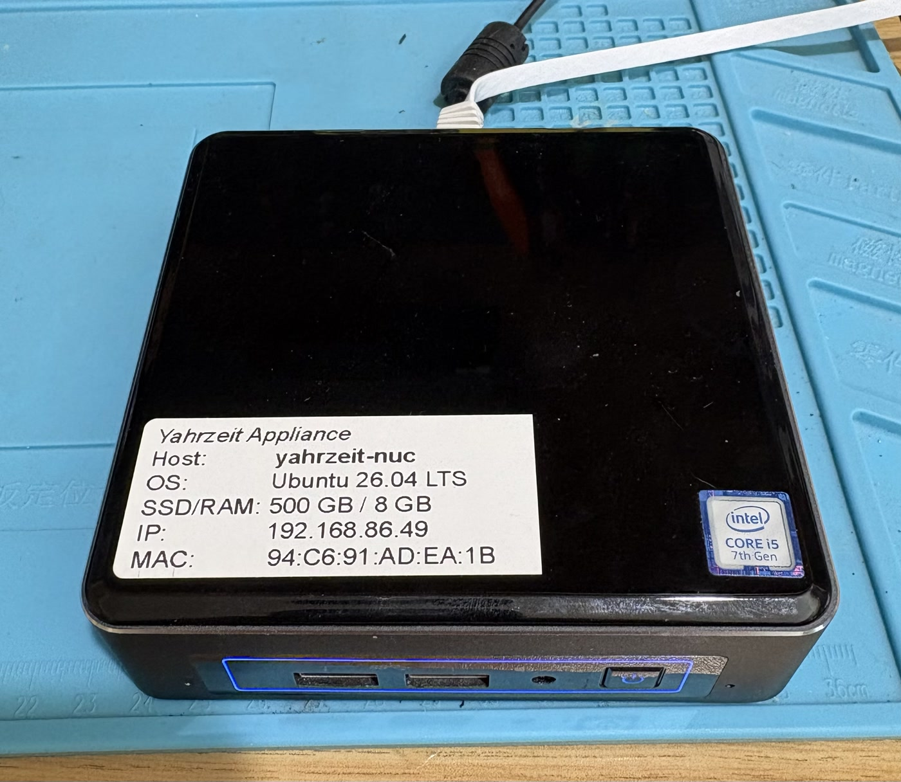

# Yahrzeit Server Appliance — Operation and Maintenance
This directory contains the PHP web application, scheduler, command-line
engine, and installer for the Congregation Beth Sholom Yahrzeit Wall
appliance.

This README is intended for future maintainers of the appliance, including
people who did not build the original system.

<p align="center">
  <a href="images/yahrzeit-server-appliance.jpg">
    
  </a>
</p>

*The Intel NUC Yahrzeit Server Appliance. Its external label records the
hostname, operating system, hardware capacity, and network information needed
for installation and recovery.*

The top-level repository README explains the whole Yahrzeit project: embedded
firmware, hardware, panel assets, and historical versions. This README is only
about the `yahrzeit_site-v3` appliance software.

## What This Appliance Does

The appliance is responsible for:

- displaying the current Yahrzeit wall status,
- rendering memorial/name views and reports,
- maintaining the memorial CSV database,
- applying synagogue lighting policy from `data/minhag.ini`,
- running scheduled Yahrzeit and Yizkor phases,
- generating controller command streams,
- and transmitting those commands to the Arduino-based wall controller.

## System Shape

The usual control path is:

```text
cron
  -> bin/yahrzeit_scheduler
    -> bin/yahrzeit
      -> bin/yahrzeit_engine.php
        -> include/yahrzeit_policy.inc.php
          -> controller command stream
          -> nc TCP connection
            -> Arduino controller
```

The web screens use the same underlying code where possible. Reports, audits,
and command previews are intended to be safe; live wall operations call
`bin/yahrzeit` and may transmit to the controller.

## Directory Layout

- `bin/` - command-line tools, scheduler, engine, and installer.
- `include/` - shared PHP helpers for dates, names, panels, LED mapping,
  lighting policy, and page layout.
- `data/` - live CSV data, `minhag.ini`, backups, and the automation log.
- `help/` - help pages shown by the web UI.
- `docs/` - project notes and generated/internal documentation.
- `css/`, `images/`, `js/` - legacy browser-side assets used by the screen
  templates.

## Important Files

- `data/yahrzeits-rev4.csv` - memorial database.
- `data/minhag.ini` - synagogue lighting policy and display settings.
- `bin/yahrzeit-controller.conf` - controller hostname/address and TCP port.
- `bin/yahrzeit` - shared scheduler/web execution stage and controller transport.
- `bin/yahrzeit_engine.php` - decides what should be lit or reported.
- `bin/yahrzeit_scheduler` - cron-facing scheduled phase runner.
- `bin/fix-up-crontab` - installs the policy-derived managed cron block.
- `include/yahrzeit_policy.inc.php` - shared day/week lighting decisions.
- `include/panels.inc.php` - static wall/panel geometry.
- `include/leds.inc.php` - maps panel/person locations to controller commands.

## Installation and Updates

The complete fresh-installation and replacement procedure is in
[`INSTALL.md`](INSTALL.md). The installer can also be rerun to update an
existing appliance:

```sh
curl -fsSL https://raw.githubusercontent.com/allanschwartz/yahrzeit/master/yahrzeit_site-v3/bin/install-yahrzeit.sh -o /tmp/install-yahrzeit.sh
bash /tmp/install-yahrzeit.sh
```

The appliance checkout is deployed code, not a development worktree. During
an update, the installer preserves `data/minhag.ini` and
`data/yahrzeits-rev4.csv`, replaces the remaining site files with the selected
remote version, and restores the live data. Source-code edits made directly on
the appliance are intentionally discarded.

## Network Configuration

There are two fixed-address concerns:

- the appliance/server address, used by operators browsing to the web UI,
- the Arduino controller address, used by `bin/yahrzeit` when transmitting
  commands.

The installer does not configure a static appliance/server IP address. On a
fresh Ubuntu appliance, configure that on-site using the local network policy,
usually in `/etc/netplan/*.yaml`.

Do not commit site-specific `/etc/netplan/*.yaml` files to this repository.

## Controller Address

The controller connection is stored as shell assignments in:

```text
bin/yahrzeit-controller.conf
```

`bin/yahrzeit` sources this file before parsing its command-line options. It
contains the controller host and port, the brightness used for normal Yahrzeit
lighting, and the brightness used for full-wall operations. Brightness values
run from 1 (brightest) through 254 (dimmest).

The installer remembers the previously recorded host and brightness values
before updating the checkout, installs the current tracked configuration, and
asks whether to keep the host or enter a replacement. The configuration file
itself is not preserved. The fixed port and transport defaults update with the
software. The Arduino controller firmware must use the matching address and
port.

For a one-command diagnostic override, use environment variables:

```sh
CONTROLLER_BRIGHTNESS=160 bin/yahrzeit --yizkor
```

## Safe Validation

From this directory, syntax-check the PHP and shell files with:

```sh
for f in $(find . -name '*.php') bin/yahrzeit_scheduler bin/fix-up-crontab; do
    php -l "$f"
done

for f in bin/yahrzeit bin/install-yahrzeit.sh; do
    bash -n "$f"
done
```

Run data/audit checks that do not transmit:

```sh
bin/yahrzeit --audit
bin/yahrzeit --dry-run
php tests/yahrzeit_engine_policy_test.php
```

## Live Controller Operations

Only run these when the controller IP is correct and it is safe to talk to the
wall:

```sh
bin/yahrzeit
bin/yahrzeit --all-off
bin/yahrzeit --all-on
bin/yahrzeit --yizkor
```

The default command applies normal Yahrzeit lighting. Use all four commands
carefully: without `--dry-run`, each transmits to the controller and changes
the wall.

## Scheduled Operation

`bin/fix-up-crontab` reads `data/minhag.ini` and manages only the marked
Yahrzeit block in the installation account's crontab. It preserves unrelated
cron jobs. Normal Yahrzeit lighting is reapplied every evening; the saved
day-only or weekly observance determines which memorial lights are selected.
Fixed times remain stable, while sunset-based times are recalculated for that
evening automatically. Yizkor on/off phases are installed only for the next
civil date of each enabled observance; the managed block is regenerated every
morning at 12:05 AM.

Every managed cron invocation appends to `data/automation.log`. Each run records
its phase, decision or action, controller transport summary, cron-repair
result, final status, and duration. Normal scheduled runs do not record the
complete controller command stream. The installer configures `logrotate` to
retain 13 compressed weekly logs without sending routine cron email.

```sh
tail -100 data/automation.log
ls -lh data/automation.log*
```

```sh
bin/fix-up-crontab --dry-run
sudo bin/fix-up-crontab
```

The installer records the intended cron account in
`/etc/yahrzeit-cron-user` and authorizes the Minhag page to invoke only this
repair helper. Rerun the installer, or the helper directly, after an operating
system upgrade or appliance migration if scheduled operation needs repair.

On hardened Ubuntu releases, Apache runs with the home directory mounted
read-only in its private service namespace and with sudoers configuration
hidden. The installer adds a systemd drop-in that makes only this site's
`data/` directory writable and permits sudo to read the single-command
authorization used by the cron-repair wrapper. The remaining Apache
filesystem protections stay enabled.

## Data Backup And Restore

The two appliance-specific live data files are:

```text
data/yahrzeits-rev4.csv
data/minhag.ini
```

The web Reports page can export and import this CSV. The upload path creates a
backup under `data/backups/` and runs an audit afterward.

Before replacing the appliance or doing major maintenance, copy:

```text
data/yahrzeits-rev4.csv
data/minhag.ini
data/backups/
bin/yahrzeit-controller.conf
```

The controller configuration is replaceable software configuration rather
than memorial data, but retaining it records the controller address selected
for that appliance.

## What Not To Change Casually

- Do not change the CSV schema without a migration plan.
- Do not change controller protocol commands unless the embedded firmware is
  updated at the same time.
- Do not edit panel geometry without running audits and checking reports.
- Do not depend on lab IP addresses in production.

## See Also

- **Project**
  - [`./README.md`](../README.md)
- **Server**
  - [`./yahrzeit_site-v3/README.md`](README.md)
  - [`./yahrzeit_site-v3/INSTALL.md`](INSTALL.md)
- **Controller**
  - [`./embedded/yahrzeit_v3/README.md`](../embedded/yahrzeit_v3/README.md)
  - [`./embedded/yahrzeit_v3/INSTALL.md`](../embedded/yahrzeit_v3/INSTALL.md)
- **Hardware**
  - [`./Hardware/README.md`](../Hardware/README.md)
